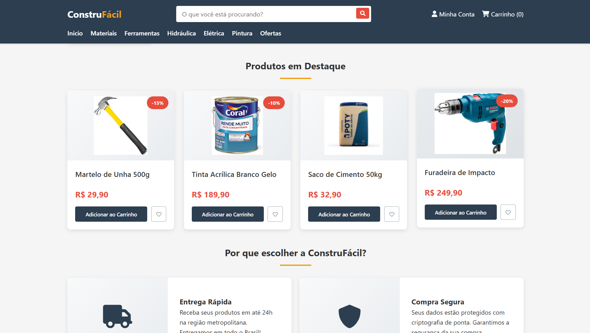

# ConstruFácil - Plataforma de E-Commerce 

## 🖥️ Preview do Sistema

  
   
  Interface principal da plataforma JobConnect

## 📋 Sobre o Projeto

**ConstruFácil** é uma plataforma de e-commerce especializada em materiais de construção, desenvolvida para oferecer uma experiência completa de compra online para profissionais da construção civil e usuários domésticos.

## 🎯 Objetivo

A plataforma tem como objetivo centralizar a venda de materiais de construção, ferramentas e equipamentos, proporcionando:
- Interface intuitiva e responsiva
- Catálogo organizado por categorias
- Processo de compra simplificado
- Informações detalhadas sobre produtos

## 🚀 Funcionalidades Principais

### 1. **Catálogo de Produtos**
- Exibição de produtos em destaque
- Organização por categorias (Ferramentas, Hidráulica, Elétrica, etc.)
- Fotos e descrições detalhadas
- Preços e promoções destacadas

### 2. **Sistema de Busca**
- Barra de pesquisa no header
- Busca por nome ou características do produto
- Interface responsiva para pesquisa

### 3. **Carrinho de Compras**
- Adição/remoção de produtos
- Contador dinâmico de itens
- Feedback visual ao adicionar produtos
- Cálculo automático de valores

### 4. **Sistema de Favoritos**
- Possibilidade de marcar produtos como favoritos
- Interface visual para identificação
- Persistência durante a sessão

### 5. **Design Responsivo**
- Adaptação para desktop, tablet e mobile
- Layout flexível usando CSS Grid e Flexbox
- Navegação otimizada para dispositivos móveis

## 🛠️ Tecnologias Utilizadas

### Frontend
- **HTML5**: Estrutura semântica
- **CSS3**: Estilização avançada com variáveis CSS
- **JavaScript**: Interatividade e funcionalidades dinâmicas
- **Font Awesome**: Ícones e elementos visuais

### Recursos de Design
- Sistema de cores consistente com variáveis CSS
- Animações e transições suaves
- Layout em grid responsivo
- Design system unificado

## 📱 Estrutura da Plataforma

### Header/Navegação
- Logo e identidade visual
- Barra de pesquisa
- Menu de categorias
- Ações do usuário (conta e carrinho)

### Seções Principais
1. **Banner Promocional**: Apresentação da marca e ofertas
2. **Categorias**: Navegação por departamentos
3. **Produtos em Destaque**: Itens selecionados
4. **Diferenciais**: Vantagens da plataforma
5. **Footer**: Informações institucionais e contato

## 🎨 Características de UX/UI

### Design System
- **Cores Primárias**: Azul escuro (#2c3e50)
- **Cores Secundárias**: Vermelho (#e74c3c) e Laranja (#f39c12)
- **Tipografia**: Segoe UI e família sans-serif
- **Espaçamento**: Sistema consistente de margins e paddings

### Experiência do Usuário
- Feedback visual imediato nas ações
- Animações de hover e interação
- Notificações de confirmação
- Navegação intuitiva

## 🔧 Como Utilizar

### Para Clientes
1. Navegue pelas categorias ou use a busca
2. Visualize detalhes dos produtos
3. Adicione itens ao carrinho
4. Acompanhe o contador de itens
5. Finalize a compra (simulação)

### Funcionalidades Interativas
- **Adicionar ao Carrinho**: Clique no botão verde
- **Favoritar**: Clique no ícone de coração
- **Buscar**: Digite e pressione Enter ou clique na lupa
- **Navegar**: Use o menu principal ou categorias

## 📊 Funcionalidades Técnicas

### JavaScript Implementado
- Gerenciamento de estado do carrinho
- Sistema de favoritos
- Manipulação do DOM
- Event listeners para interações
- Simulação de processos de compra

### Responsividade
- Breakpoints para mobile (768px) e tablet
- Reorganização de elementos
- Menu adaptável
- Grids flexíveis

## 🎯 Público-Alvo

- **Construtoras e Empresas**: Compra em larga escala
- **Profissionais Autônomos**: Pedreiros, eletricistas, encanadores
- **DIY (Faça Você Mesmo)**: Usuários domésticos
- **Reformas e Reparos**: Pequenas e médias obras

## 💡 Próximas Implementações Sugeridas

1. **Backend Integration**: Conexão com banco de dados real
2. **Sistema de Pagamento**: Integração com gateways
3. **Área do Cliente**: Login, histórico de pedidos
4. **Busca Avançada**: Filtros por preço, marca, etc.
5. **Sistema de Avaliações**: Feedback sobre produtos
6. **Estoque em Tempo Real**: Disponibilidade atualizada

## 📞 Suporte

Para dúvidas ou sugestões:
- **Telefone**: (11) 4004-1234
- **Email**: contato@construfacil.com
- **Endereço**: Av. Paulista, 1000 - São Paulo/SP

---

**ConstruFácil** - Transformando suas ideias em realidade, um tijolo de cada vez! 🏗️✨
